{::options parse_block_html="true" /}
<section class="content-services" id="SERVICES">

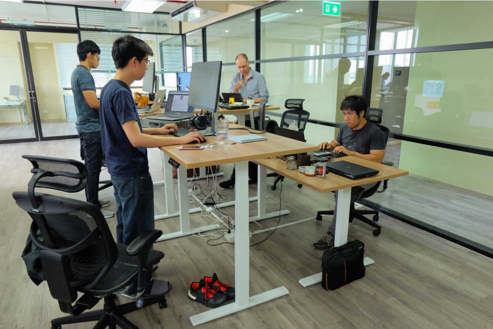

## SALWEEN SOLUTIONS

has been developing software 
used all over the world for over 
ten years.

### We produce
web, mobile and desktop applications using a range of technologies.

<a href="https://salweensolutions.com/#Technologies" class="scroll">
<i class="fa glyphicon glyphicon-menu-down"></i>
<i class="fa glyphicon glyphicon-menu-down"></i>
</a>

## Our software products
{: .animated }
<section class="image-wrapper img01 animated">
{: .img-responsive }
### Web applications
Usable, Responsive,  and Secure Applications
</section>
<section class="image-wrapper img02 animated">
{: .img-responsive }
### Mobile apps
Apps developed for iOS and Android platforms
</section>
<section class="image-wrapper img03 animated">
{: .img-responsive }
### Desktop applications
Universal Windows Platform (UWP) apps Windows desktop apps macOS apps
</section>

<section id="Technologies" class="technologies-wrapper">
## Technologies
{: .animated }

-   
Orchard
-   
.Net Core
-   
ReactJS
-   
React Native
-   
C# 6.0
-   
Cordova
-   
Git and Github
-   
HTML5
-   
CSS3
-   
Java
-   
Javascript
-   
jQuery
-   
Objective C
-   
Python
-   
Selenium
-   
Slack
-   
Trello and Trello API
-   
Window Azure

<a href="https://salweensolutions.com/#TEAM" class="scroll">
<i class="fa glyphicon glyphicon-menu-down"></i>
<i class="fa glyphicon glyphicon-menu-down"></i>
</a>

</section>
</section>
<section class="based-area" id="ABOUT">

## Headquarter in Bangkok
{: .animated}
### One of Thailand's cutting edge software development companies
{: .animated }

- [Test Driven Development](https://salweensolutions.com "Test Driven Development")    
- [Agile Methodologies](https://salweensolutions.com "Agile Methodologies")    
- [Continuous Integration](https://salweensolutions.com "Continuous Integration")   
- [End to end testing](https://salweensolutions.com "End to end testing")  
- {: .ms-gold}[Microsoft Gold Partners](https://salweensolutions.com "Microsoft Gold Partners")

## We have generated award-winning software products since 2006.
{: .animated}
### Our software has been awarded 8 AVA Digital awards including a platinum trophy for Web-Based Production Mobile App for Entertainment and an International Hermes Creative Award for Mobile Conference/Event App.
{: .animated }

</section>
<section class="awards">
## Awards

- 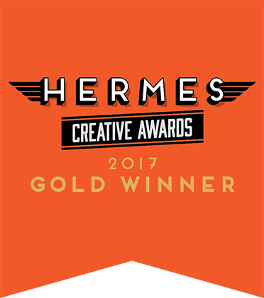{: .img-responsive .img-rounded}
- {: .img-responsive .img-rounded}
- 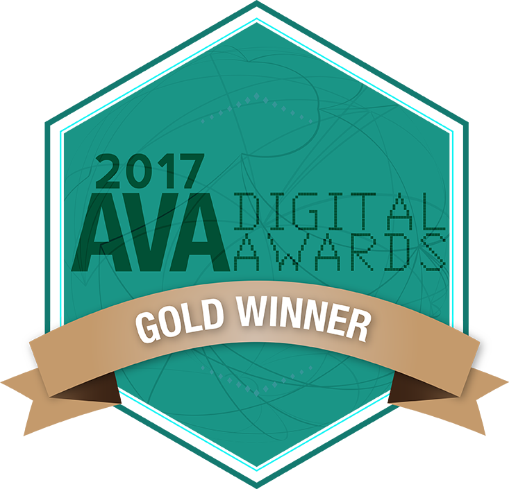{: .img-responsive .img-rounded}

</section>
<section class="content-team" id="TEAM">
{::options auto_ids="false" /}

## We are a Team of Developers & Suits
### The Developers

{: .photo01 .animated}
- 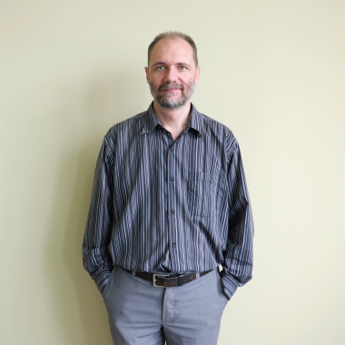{:  .animated}
#### Jean    
##### Software Architect
No work day is complete without **pushing or merging a pull request.**  
When I have free time, I spend it on **_free/libre_ software [gnu.org](https://www.gnu.org/)**

- 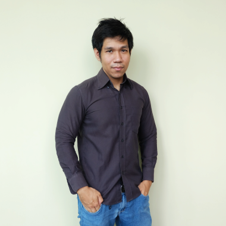{: .animated}  
#### Ton  
##### Senior Developer
No work day is complete without **a Scrum meeting.**  
When I have free time I spend it doing **push-ups and sit-ups.**

- 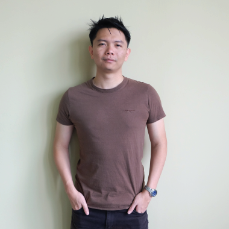{: .animated}  
#### Orc  
##### Senior Developer
No work day is complete without **TASKS**  
When I have free time I spend it **PLAYING GAMES**

- 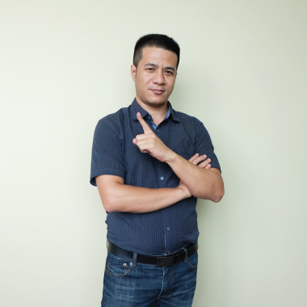{: .animated}  
#### Phyo
##### Software Developer
No work day is complete without **a cup of coffee.**  
When I have free time I spend it **reading or watching football matches.**

- {: .animated}
#### Koon    
##### Software Developer
No work day is complete without **some great food.**  
When I have free time I spend it **working out and traveling.**

{: .photo02 .animated}
- 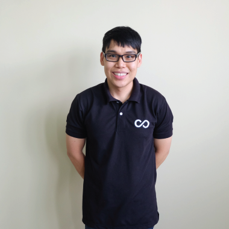{: .animated}
#### Tae    
##### Graphic designer
No work day is complete without **amusement.**  
When I have free time I spend it **listening to music.**

- {: .animated}
#### Fai    
##### Software Developer
No work day is complete without **learning.**  
When I have free time I spend it **planting trees, reading books, and watching movies.**

- {: .animated}
#### Pek    
##### Software Developer
No work day is complete without **some snacks.**  
When I have free time I spend it **reading and watching YouTube channels.**

- 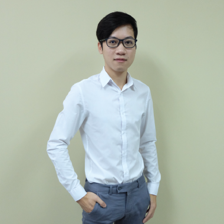{: .animated}
#### James    
##### Software Developer
No work day is complete without **a bar of chocolate.**
When I have free time I spend it **practicing my programming skills.**

- {: .animated}
#### Ying    
##### Software Developer
No work day is complete without **thinking.**
When I have free time I spend it **grow cactus and listen to the music.**

- 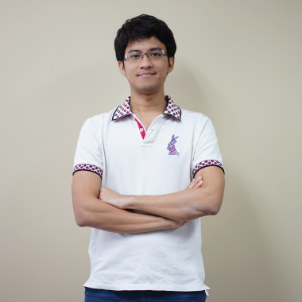{: .animated}
#### Tul    
##### Software Developer
No work day is complete without **pushing commits.**  
When I have free time I spend it **on gaming, coding, and travelling.**

- {: .animated}
#### Maii    
##### Software Developer
No work day is complete without  **searching.**
When I have free time I spend it **playing music.**

### The Suits

{: .animated .theSuits}
- {: .animated}
#### Charles    
##### Managing Director
No work day is complete without **podcasts and to-do lists.**  
When I have free time I spend it **rebuilding my media center.**
- 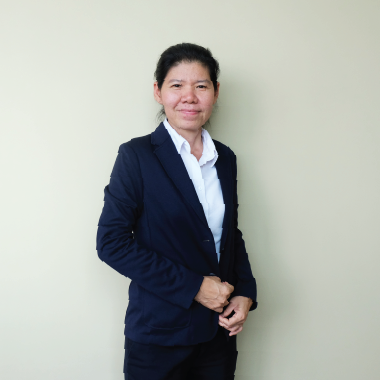{: .animated}
#### Jun    
##### Administration and HR Manager
No work day is complete without **my favorite coffee AHa.**  
When I have free time I spend it **playing with my three dogs.**
</section>
<section class="job" id="job">

## Jobs
If you're looking for a challenging career with an established and growing company, contact us

### QA Engineer
-	Bachelor’s degree in Computer Science Degree or related fields
- Minimum 3 year experiences as QA Engineer
- Techniques used include integration testing, unit testing, monitoring and load testing, process automation, executable documentation, fitness functions, and deployment pipelines.
- Proficiency in relevant technologies :  Cucumber tests (for C# and Javascript (web and mobile) backends), Ansible, TeamCity, K6.io, Prometheus, Wix Detox, and API Blueprint for specifying and mocking services
- Team player: train and empower developers to rely on testing
- Ability to research and evaluate technology in a fast-moving field
- Ability to work independently
- Ability to meet deadlines

### Software Developer  
- C#
- Orchard CMS
- .NET MVC  

### Frontend Developer   
- ReactJS
- Angular
- Bootstrap, Less, Sass  

### Mobile Developer  
- React Native
- Cordova
- iOS
- Android  

### Some of the benefits of working with us:
- Competitive salary depending upon work experiences
- A private Aetna Health Insurance
- 12 holidays per year
- Annual trip (outing) with the team
- Working with great colleagues in an international and modern work environment
- Opportunities to learn the cutting edge of development technologies
- Flexible office hours ( start early - leave early )

</section>

<footer>

<section>
## CONTACT US
Phone:
: +66-2-0246687  

Email:
: inquiries@salweensolutions.com
Feel free to chat with us
</section>
<section>
## LOCATION
3 Promphan 3 Building, 13th Floor, Unit 1308 - 1312  
Ladphrao Soi 3, Ladphrao Road, Chompol,  
Chatuchak, Bangkok 10900  
Thailand
</section>

- 
- 

</footer>
