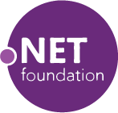
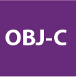

{::options parse_block_html="true" /}
<section class="content-services" id="SERVICES">

## SALWEEN SOLUTIONS

have been Developing Software 
used all over the world for more than 
ten years.

### We develop
#### web, mobile desktop, applications
applications using a range of technologies.

<a href="#Technologies" class="scroll">
<i class="fa glyphicon glyphicon-menu-down"></i>
<i class="fa glyphicon glyphicon-menu-down"></i>
</a>

</section>
<section class="content-services">
  

    

      
    

    

      

        <h2>SALWEEN SOLUTIONS</h2>
        
have been Developing Software used all over the world for more than ten years.

      

        <h3>We develop</h3>
        <h4>web, mobile desktop, applications</h4>
      
applications using a range of technologies.

    

  

</section>
<section class="content-services">

## Types of software we develop
{: .animated }
<section class="image-wrapper img01 animated">
{: .img-responsive }
### Web applications
Applications that run  responsive design, Security
</section>
<section class="image-wrapper img02 animated">
{: .img-responsive }
### Mobile applications
We develop for  IOS, Android, Web
</section>
<section class="image-wrapper img03 animated">
{: .img-responsive }
### Desktop applications
Windows desktops apps  macOS apps  Universal Windows Platform (UWP) apps.
</section>

  

    

      <h2>Types of software we develop</h2>
      <section class="image-wrapper">
        
        <h3>Web applications</h3>
        

          Applications that run  responsive design, Security
        

      </section>
      <section class="image-wrapper">
        
        <h3>Mobile applications</h3>
        

          We develop for  IOS, Android, Web
        

      </section>
      <section class="image-wrapper">
        
        <h3>Desktop applications</h3>
        

          Windows desktops apps  macOS apps  Universal Windows Platform (UWP) apps.
        

      </section>
    

  

</section>
<section class="content-services">
<section id="Technologies" class="technologies-wrapper">
## Technologies
{: .animated }

-   
Orchard
-   
.Net Core
-   
ReactJS
-   
React Native
-   
C# 6.0
-   
Cordova
-   
Git and Github
-   
HTML5
-   
CSS
-   
Java
-   
Javascript
-   
JQuery
-   
Objective C
-   
Phython
-   
Selenium
-   
Slack
-   
Trello and Trello API
-   
Window Azure

<a href="#TEAM" class="scroll">
<i class="fa glyphicon glyphicon-menu-down"></i>
<i class="fa glyphicon glyphicon-menu-down"></i>
</a>

</section>
</section>
<section class="technologies-wrapper">
  <h2>Technologies</h2>
  

    

      <ul class="row">
        <li>
          
          
Orchard

        </li>
        <li>
          
          
.Net Core

        </li>
        <li>
          
          
ReactJS

        </li>
        <li>
          
          
React Native

        </li>
        <li>
          
          
C# 6.0

        </li>
        <li>
          
          
Cordova

        </li>
        <li>
          
          
Git and Github

        </li>
        <li>
          
          
HTML5

        </li>
        <li>
          
          
CSS

        </li>
        <li>
          
          
Java

        </li>
        <li>
          
          
Javascript

        </li>
        <li>
          
          
JQuery

        </li>
        <li>
          
          
Objective C

        </li>
        <li>
          
          
Phython

        </li>
        <li>
          
          
Selenium

        </li>
        <li>
          
          
Slack

        </li>
        <li>
          
          
Trello and Trello API

        </li>
        <li>
          
          
Window Azure

        </li>
      </ul>
    

  

</section>

<section class="content-services">

## We are based in Bangkok
{: .animated}
### We've been developing software for over ten years
{: .animated }

- [Test Driver Development](http://salween.com "Test Driver Development")    
- [Continuous Integration](http://salween.com "Continuous Integration")    
- [End to end testing ](http://salween.com "End to end testing")   
- [Agile Methodologies](http://salween.com "Agile Methodologies")  
- [Microsoft Gold Parners ](http://salween.com "Microsoft Gold Parners")  

  

</section>

  

    

      <h2>We are based in Bangkok</h2>
      <h3>We've been developing software for over ten years</h3>
      <ul class="clearfix">
        <li><a href="#">Test Driver Development</a></li>
        <li><a href="#">Continuous Integration</a></li>
        <li><a href="#">End to end testing</a></li>
        <li><a href="#">Agile Methodologies</a></li>
        <li><a href="#">Microsoft Gold Parners</a></li>
      </ul>
      

    

  

<section class="content-team" id="TEAM">
{::options auto_ids="false" /}

## We are a Team of Planner & Developer
### Lorem ipsum dolor sit amet, consectetur adipiscing elit. Proin quis eros semperenim rhoncus convallis sit amet ac mi.

- {:  .animated}
#### Jun    
##### ADMINISTRATION & HR MANAGER
"QUIS EROS SEMPERENIM RHONCUS CONVALLIS SIT AMET AC MI."
- {: .animated}  
#### Jun    
##### ADMINISTRATION & HR MANAGER
"QUIS EROS SEMPERENIM RHONCUS CONVALLIS SIT AMET AC MI."

- {: .animated}  
#### Jun    
##### ADMINISTRATION & HR MANAGER
"QUIS EROS SEMPERENIM RHONCUS CONVALLIS SIT AMET AC MI."

- {: .animated}  
#### Jun    
##### ADMINISTRATION & HR MANAGER
"QUIS EROS SEMPERENIM RHONCUS CONVALLIS SIT AMET AC MI."

- {: .animated}
#### Jun    
##### ADMINISTRATION & HR MANAGER
"QUIS EROS SEMPERENIM RHONCUS CONVALLIS SIT AMET AC MI."

- {: .animated}
#### Jun    
##### ADMINISTRATION & HR MANAGER
"QUIS EROS SEMPERENIM RHONCUS CONVALLIS SIT AMET AC MI."

- {: .animated}
#### Jun    
##### ADMINISTRATION & HR MANAGER
"QUIS EROS SEMPERENIM RHONCUS CONVALLIS SIT AMET AC MI."

- {: .animated}
#### Jun    
##### ADMINISTRATION & HR MANAGER
"QUIS EROS SEMPERENIM RHONCUS CONVALLIS SIT AMET AC MI."

- {: .animated}
#### Jun    
##### ADMINISTRATION & HR MANAGER
"QUIS EROS SEMPERENIM RHONCUS CONVALLIS SIT AMET AC MI."

- {: .animated}
#### Jun    
##### ADMINISTRATION & HR MANAGER
"QUIS EROS SEMPERENIM RHONCUS CONVALLIS SIT AMET AC MI."

</section>
<section>
  <h2>We are a Team of Planner & Developer</h2>
  <h3>Lorem ipsum dolor sit amet, consectetur adipiscing elit. Proin quis eros semperenim rhoncus convallis sit amet ac mi.</h3>
  

    <ul>
      <li>
        
        

          <h4>Jun</h4>
          
ADMINISTRATION & HR MANAGER

          
"QUIS EROS SEMPERENIM RHONCUS CONVALLIS SIT AMET AC MI."

        

      </li>
      <li>
        
        

          <h4>Jun</h4>
          
ADMINISTRATION & HR MANAGER

          
"QUIS EROS SEMPERENIM RHONCUS CONVALLIS SIT AMET AC MI."

        

      </li>
      <li>
        
        

          <h4>Jun</h4>
          
ADMINISTRATION & HR MANAGER

          
"QUIS EROS SEMPERENIM RHONCUS CONVALLIS SIT AMET AC MI."

        

      </li>
      <li>
        
        

          <h4>Jun</h4>
          
ADMINISTRATION & HR MANAGER

          
"QUIS EROS SEMPERENIM RHONCUS CONVALLIS SIT AMET AC MI."

        

      </li>
      <li>
        
        

          <h4>Jun</h4>
          
ADMINISTRATION & HR MANAGER

          
"QUIS EROS SEMPERENIM RHONCUS CONVALLIS SIT AMET AC MI."

        

      </li>
      <li>
        
        

          <h4>Jun</h4>
          
ADMINISTRATION & HR MANAGER

          
"QUIS EROS SEMPERENIM RHONCUS CONVALLIS SIT AMET AC MI."

        

      </li>
      <li>
        
        

          <h4>Jun</h4>
          
ADMINISTRATION & HR MANAGER

          
"QUIS EROS SEMPERENIM RHONCUS CONVALLIS SIT AMET AC MI."

        

      </li>
      <li>
        
        

          <h4>Jun</h4>
          
ADMINISTRATION & HR MANAGER

          
"QUIS EROS SEMPERENIM RHONCUS CONVALLIS SIT AMET AC MI."

        

      </li>
      <li>
        
        

          <h4>Jun</h4>
          
ADMINISTRATION & HR MANAGER

          
"QUIS EROS SEMPERENIM RHONCUS CONVALLIS SIT AMET AC MI."

        

      </li>
      <li>
        
        

          <h4>Jun</h4>
          
ADMINISTRATION & HR MANAGER

          
"QUIS EROS SEMPERENIM RHONCUS CONVALLIS SIT AMET AC MI."

        

      </li>
    </ul>
  

</section>
<section class="content-contact-us" id="ABOUT">

</section>

<section>
  

    "id = google-map" Google map Area
  

</section>
<footer id="CONTACT">

<section>
## CONTACT US
Phone:
: 111-258-8574  

Fax:
: 475-854-8520

Email:
: inquiries@salweensolutions.com
Feel free to chat with us
</section>
<section>
## LOCATION
1 Promphan 2 Building, 8th Floor, Office 800  
Lat Phrao Soi 3, Chompol  
Bangkok, Chatuchak 10900  
Thailand
</section>
<section class="social-link">
- 
- 
- 
- 
</section>

</footer>
<footer>
  

    <section>
      <h2>CONTACT US</h2>
      <dl class="clearfix">
        <dt>Phone:</dt>
        <dd>111-258-8574</dd>
        <dt>Fax:</dt>
        <dd>475-854-8520</dd>
        <dt>Email:</dt>
        <dd>inquiries@salweensolutions.com</dd>
      </dl>
      
Feel free to chat with us

    </section>
    <section>
      <h2>LOCATION</h2>
      
1 Promphan 2 Building, 8th Floor, Office 800 Lat Phrao Soi 3, Chompol Bangkok, Chatuchak 10900 Thailand

    </section>
    <section class="social-link">
      <ul class="clearfix">
        <li></li>
        <li></li>
        <li></li>
        <li></li>
      </ul>
    </section>
  

</footer>
