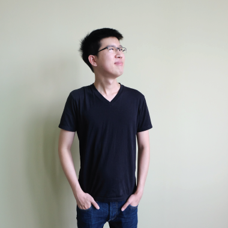

{::options parse_block_html="true" /}
<section class="content-services" id="SERVICES">

## SALWEEN SOLUTIONS

have been developing software 
used all over the world for more than 
ten years.

### We develop
web, mobile and desktop applications using a range of technologies.

<a href="#Technologies" class="scroll">
<i class="fa glyphicon glyphicon-menu-down"></i>
<i class="fa glyphicon glyphicon-menu-down"></i>
</a>

## Software we develop
{: .animated }
<section class="image-wrapper img01 animated">
{: .img-responsive }
### Web applications
Applications that are  Usable, Responsive and Secure
</section>
<section class="image-wrapper img02 animated">
{: .img-responsive }
### Mobile apps
We develop for iOS and Android
</section>
<section class="image-wrapper img03 animated">
{: .img-responsive }
### Desktop applications
Universal Windows Platform (UWP) apps Windows desktops apps macOS apps
</section>

<section id="Technologies" class="technologies-wrapper">
## Technologies
{: .animated }

-   
Orchard
-   
.Net Core
-   
ReactJS
-   
React Native
-   
C# 6.0
-   
Cordova
-   
Git and Github
-   
HTML5
-   
CSS3
-   
Java
-   
Javascript
-   
jQuery
-   
Objective C
-   
Python
-   
Selenium
-   
Slack
-   
Trello and Trello API
-   
Window Azure

<a href="#TEAM" class="scroll">
<i class="fa glyphicon glyphicon-menu-down"></i>
<i class="fa glyphicon glyphicon-menu-down"></i>
</a>

</section>
</section>
<section class="based-area" id="ABOUT">

## We are based in Bangkok
{: .animated}
### We’ve been developing software for over ten years.
{: .animated }

- [Test Driven Development](http://salween.com "Test Driven Development")    
- [Agile Methodologies](http://salween.com "Agile Methodologies")    
- [Continuous Integration](http://salween.com "Continuous Integration")   
- [End to end testing](http://salween.com "End to end testing")  
- [Microsoft Gold Partners](http://salween.com "Microsoft Gold Partners")  

  

</section>

<section class="content-team" id="TEAM">
{::options auto_ids="false" /}

## We are a Team of Planner & Developer
### The Developers

{: .photo01 .animated}
- {:  .animated}
#### Jean    
##### Software Architect
"QUIS EROS SEMPERENIM RHONCUS CONVALLIS SIT AMET AC MI."
- {: .animated}  
#### Ton  
##### Senior Developer
"QUIS EROS SEMPERENIM RHONCUS CONVALLIS SIT AMET AC MI."

- {: .animated}  
#### Orc  
##### Senior Developer
"QUIS EROS SEMPERENIM RHONCUS CONVALLIS SIT AMET AC MI."

- {: .animated}
#### Note   
##### Software Developer
"QUIS EROS SEMPERENIM RHONCUS CONVALLIS SIT AMET AC MI."

- {: .animated}  
#### Phyo
##### Software Developer
"QUIS EROS SEMPERENIM RHONCUS CONVALLIS SIT AMET AC MI."

{: .photo02 .animated}
- {: .animated}
#### Koon    
##### Software Developer
"QUIS EROS SEMPERENIM RHONCUS CONVALLIS SIT AMET AC MI."

- {: .animated}
#### Santi    
##### Software Developer
"QUIS EROS SEMPERENIM RHONCUS CONVALLIS SIT AMET AC MI."

- {: .animated}
#### Fai    
##### Software Developer
"QUIS EROS SEMPERENIM RHONCUS CONVALLIS SIT AMET AC MI."

- {: .animated}
#### Pek    
##### Software Developer
"QUIS EROS SEMPERENIM RHONCUS CONVALLIS SIT AMET AC MI."

### The Suits

{: .animated .theSuits}
- {: .animated}
#### Charles    
##### Managing Director
"QUIS EROS SEMPERENIM RHONCUS CONVALLIS SIT AMET AC MI."

- {: .animated}
#### Jun    
##### Administration and HR Manager
"QUIS EROS SEMPERENIM RHONCUS CONVALLIS SIT AMET AC MI."
</section>
<section class="job" id="job">

## Jobs
If you’re looking for a challenge, contact us!

### Software Developer  
- C#
- Orchard CMS
- .NET MVC  

### Frontend Developer   
- ReactJS
- Angular
- Bootstrap, Less, Sass  

### Mobile Developer  
- React Native
- Cordova
- iOS
- Android  

</section>

<footer>

<section>
## CONTACT US
Phone:
: +66-2-9386298  

Email:
: inquiries@salweensolutions.com
Feel free to chat with us
</section>
<section>
## LOCATION
1 Promphan 3 Building, 13th Floor, Unit 1308 - 1312  
Soi 3, Ladphrao Road, Chompol,  
Chatuchak, Bangkok 10900  
Thailand
</section>

- 
- 

</footer>
