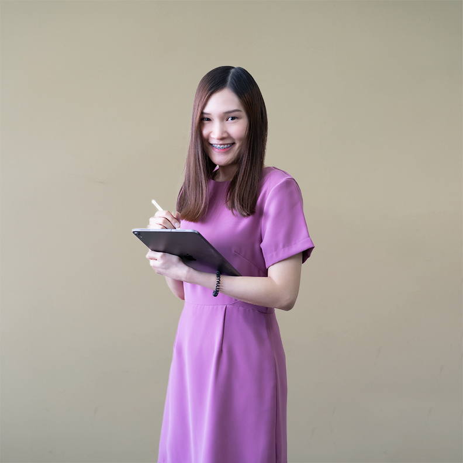
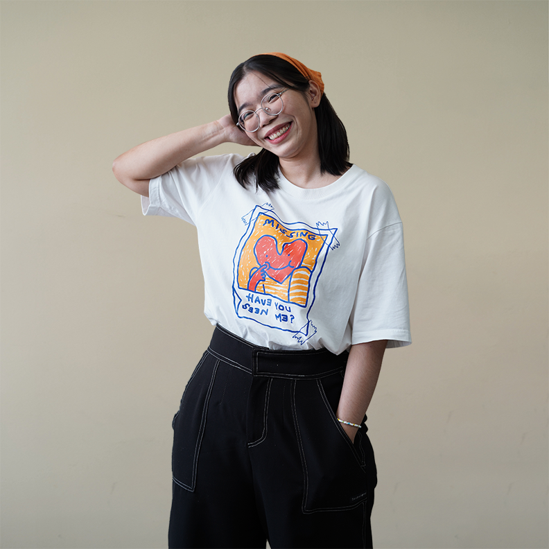
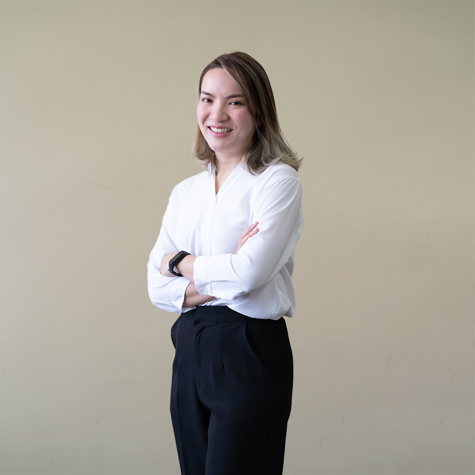
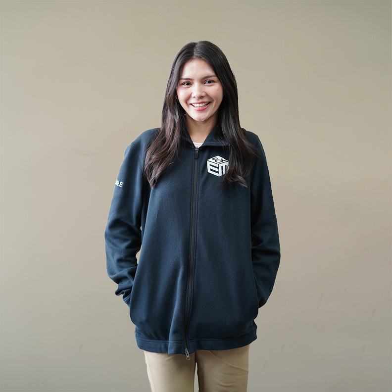
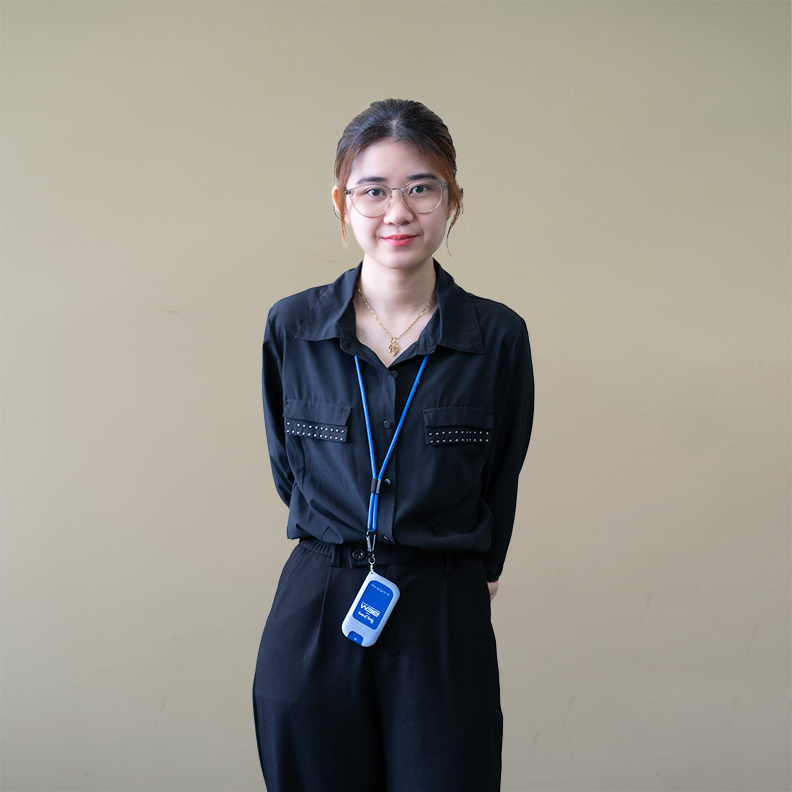
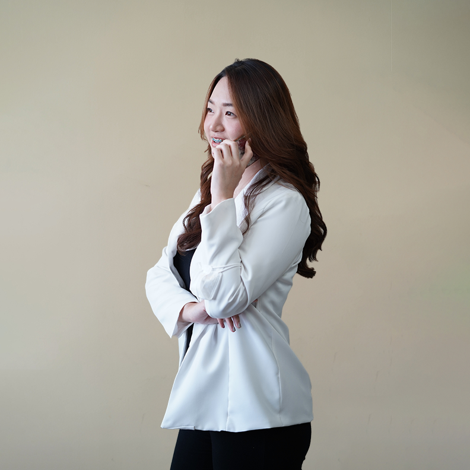
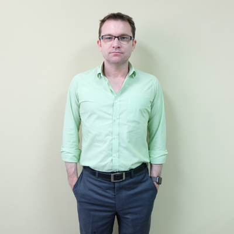

{::options parse_block_html="true" /}
<section class="content-services" id="SERVICES">

## SALWEEN SOLUTIONS

has been developing software 
used all over the world for over 
ten years.

### We produce
web, mobile and desktop applications using a range of technologies.

<a href="https://salweensolutions.com/#Technologies" class="scroll">
<i class="fa glyphicon glyphicon-menu-down"></i>
<i class="fa glyphicon glyphicon-menu-down"></i>
</a>

## Our software products
{: .animated }
<section class="image-wrapper img01 animated">
{: .img-responsive }
### Web applications
Usable, Responsive,  and Secure Applications
</section>
<section class="image-wrapper img02 animated">
{: .img-responsive }
### Mobile apps
Apps developed for iOS and Android platforms
</section>
<section class="image-wrapper img03 animated">
{: .img-responsive }
### Desktop applications
Universal Windows Platform (UWP) apps Windows desktop apps macOS apps
</section>

<section id="Technologies" class="technologies-wrapper">
## Technologies
{: .animated }

-   
Orchard
-   
.Net Core
-   
ReactJS
-   
React Native
-   
C# 6.0
-   
Cordova
-   
Git and Github
-   
HTML5
-   
CSS3
-   
Java
-   
Javascript
-   
jQuery
-   
Objective C
-   
Python
-   
Selenium
-   
Slack
-   
Trello and Trello API
-   
Window Azure

<a href="https://salweensolutions.com/#TEAM" class="scroll">
<i class="fa glyphicon glyphicon-menu-down"></i>
<i class="fa glyphicon glyphicon-menu-down"></i>
</a>

</section>
</section>
<section class="based-area" id="ABOUT">

## Headquarter in Bangkok
{: .animated}
### One of Thailand's cutting edge software development companies
{: .animated }

- [Test Driven Development](https://salweensolutions.com "Test Driven Development")    
- [Agile Methodologies](https://salweensolutions.com "Agile Methodologies")    
- [Continuous Integration](https://salweensolutions.com "Continuous Integration")   
- [End to end testing](https://salweensolutions.com "End to end testing")  
- {: .ms-gold}[Microsoft Gold Partners](https://salweensolutions.com "Microsoft Gold Partners")

## We have generated award-winning software products since 2006.
{: .animated}
### Our software has been awarded 8 AVA Digital awards including a platinum trophy for Web-Based Production Mobile App for Entertainment and an International Hermes Creative Award for Mobile Conference/Event App.
{: .animated }

</section>
<section class="awards">
## Awards

- {: .img-responsive .img-rounded}
- {: .img-responsive .img-rounded}
- {: .img-responsive .img-rounded}

</section>
<section class="content-team" id="TEAM">
{::options auto_ids="false" /}

## We are a Team of Developers & Suits
### The Developers

{: .photo01 .animated}
- {: .animated}  
#### Ton  
##### Software Applications Architect
No work day is complete without **a Scrum meeting.**  
When I have free time I spend it doing **push-ups and sit-ups.**

- {: .animated}  
#### Orc  
##### Senior Software Developer
No work day is complete without **TASKS**  
When I have free time I spend it **PLAYING GAMES & PHOTO SHOOTING**

- {: .animated}  
#### Phyo
##### Software Developer
No work day is complete without **a cup of coffee.**  
When I have free time I spend it **reading or watching football matches.**

- {: .animated}
#### Koon    
##### Software Developer
No work day is complete without **some great food.**  
When I have free time I spend it **working out and traveling.**

- {: .animated}
#### Sai
##### Software Developer
No work day is complete without **energetic music.**
When I have free time I spend it **watching movies or chilling with games.**

{: .photo02 .animated}

- {: .animated}
#### Pek    
##### Software Developer
No work day is complete without **some snacks.**  
When I have free time I spend it **reading and watching YouTube channels.**

- {: .animated}
#### Ying    
##### Software Developer
No work day is complete without **thinking.**
When I have free time I spend it **grow cactus and listen to the music.**

- {: .animated}
#### Fai    
##### Software Developer
No work day is complete without **learning.**  
When I have free time I spend it **planting trees, reading books, and watching movies.**

- {: .animated}
#### Tae    
##### Graphic Designer
No work day is complete without **amusement.**  
When I have free time I spend it **listening to music.**

- {: .animated}
#### Ae

- {: .animated}
#### Aim

- {: .animated}
#### Amy

- {: .animated}
#### Ann

- {: .animated}
#### Aum

- {: .animated}
#### Cartoon

- {: .animated}
#### Cin

- {: .animated}
#### Fahsai

- {: .animated}
#### Jam

- {: .animated}
#### Jin

- {: .animated}
#### Job

- {: .animated}
#### Kim

- {: .animated}
#### Max

- {: .animated}
#### May

- {: .animated}
#### Muay

- {: .animated}
#### Noey

- {: .animated}
#### Nook

- {: .animated}
#### Noom

- {: .animated}
#### Pookie

- {: .animated}
#### Prae

- {: .animated}
#### Prae

- {: .animated}
#### Toi

- {: .animated}
#### Ying

### The Suits

{: .animated .theSuits}
- {: .animated}
#### Charles    
##### Managing Director
No work day is complete without **podcasts and to-do lists.**  
When I have free time I spend it **rebuilding my media center.**
- {: .animated}
#### Jun    
##### Administration and HR Manager
No work day is complete without **a cup of ice Cappuccino.**
When I have free time I spend it **with my dogs.**
- {: .animated}
#### Cherie    

</section>
<section class="job" id="job">

## Careers
At Salween – our philosophy is to build careers – any company can provide a job – through trust, commitment to excellence and our belief in family first, Salween is where dreams become reality.

Salween Solutions is a fast-growing Software and App Development Bangkok company and Microsoft Gold Partner. We provide products and services for E&M Consulting, Inc., a National award-winning Publishing and Software/App company headquartered in the United States. Join Salween as a career-driven full-time Administrative Assistant.
 
## Administrative Assistant

### Qualifications:
- Exceptional English verbal and written communication is required
- Proficient in Microsoft Word, Excel, Outlook and Computer Operations
- University Degree preferred (New graduates are encouraged to apply)
- Experience using database software 
- Excellent attendance, organization and punctuality 

### Job Responsibilities:
- Database Entry and updating
- Email Communication with clients in America
- Research

### Benefits:
- FT position: Monday – Friday 10.00 am – 7.00 pm 1 hour lunch/dinner break
- Private Aetna Health Insurance
- Paid Holidays
- Paid Time Off (PTO)
- Advancement opportunities
- Company lunches and outings
- 90 Day Review for performance and potential pay increase (avg 2,000-4,000)
- 18,000 Baht per month + weekly incentive bonus (avg 6,000+)

### Deadline of application:   <em>30 September 2022</em>

Interested applicants are required to submit a full detailed of qualifications and experience with CV in English to <a href="mailto:Cherie.p1602@gmail.com">Cherie.p1602@gmail.com</a>

<em>“Only short lists are requested to attend job interviews”</em>

Salween Solutions is a fast paced rapidly-growing Software and App Development Bangkok company. Join the Microsoft Certified Gold Partner Development Team as a Graphic Designer.  We provide digital professional services for E&M Consulting, Inc., an award-winning Publishing and Software/App company headquartered in the United States.
 

## Graphic Designer

### Qualifications:
- Exceptional English reading, written and verbal communication is required
- Proficient in Adobe InDesign, Photoshop and Illustrator or website design
- Proficient in Microsoft Office Suite and Computer Operations
- University Degree (New graduates are encouraged to apply)

### Job Responsibilities:
- Map creations, ad creation, website design, publication formatting
- Digital publication layout formatting and manipulation, using InDesign and Excel
- Creation of Maps, using Illustrator
- Advertisement Design, using Photoshop

### Benefits:
- Monday – Friday 
- Work with the 2nd largest award winning Not for Profit Publisher in the United States
- Private Aetna Health Insurance
- Paid Holidays
- Paid Time Off (PTO)
- Company lunches and outings
- Advancement opportunities
- 90 Day Review for performance and potential pay increase (avg 2,000-4,000)
- 22,000 Baht per month salary

### Deadline of application:   <em>30 September 2022</em>

Interested applicants are required to submit a full detailed of qualifications and experience with CV in English to <a href="mailto:Cherie.p1602@gmail.com">Cherie.p1602@gmail.com</a>

<em>“Only short lists are requested to attend job interviews”</em>

Salween Solutions is a Gold Certified Microsoft Partner and one of Thailand’s cutting edge software development companies with clients all over the world. We are also a BOI promoted company located in central Bangkok where is easily accessed by the MRT subway train and BTS skytrain.  
We are now opening a position for React Native Mobile Developer to offer you an opportunity to work with the experienced development team on challenging projects.    
Your main responsibility will be to work with the mobile developer team to design and develop custom business application for our clients.

 

## React Native Mobile Developer

### Basic Requirements:
- Thai Nationality only
- Bachelor’s degree in Computer Science Degree or related fields
- Ability to work independently
- Ability to meet deadlines

### Technology Requirements:
- Minimum 3 years of experience in programming
- Experience with React Native or other ReactJS frameworks
- Experience with REST API
- Have a good background/ knowledge in HTML 5, CSS 3, JavaScript
- Experience with styled-components, Jest, E2E testing, GraphQL, TypeScript, Monorepo is a plus

### Some of the benefits of working with us:
- Competitive salary depending upon work experience
- Bupa Premium Health Insurance
- 12 holidays per year
- Annual trip (outing) with the team 
- Working with great colleagues in an international and modern work environment
- Opportunities to learn the cutting edge of development technologies
- Flexible office hours 

### Deadline of application:   <em>30 September 2022</em>

To apply send your CV to <a href="mailto:jun@salweensolutions.com">jun@salweensolutions.com</a>

<em>“Only short lists are requested to attend job interviews”</em>

### Software Developer  
- C#
- Orchard CMS
- .NET MVC  

### Frontend Developer   
- ReactJS
- Bootstrap, Less, Sass  

### Mobile Developer  
- React Native
- iOS
- Android  

</section>

<footer>

<section>
## CONTACT US
Phone:
: +66-2-0246687  

Email:
: inquiries@salweensolutions.com
Feel free to chat with us
</section>
<section>
## LOCATION
3 Promphan 3 Building, 13th Floor, Unit 1308 - 1312  
Ladphrao Soi 3, Ladphrao Road, Chompol,  
Chatuchak, Bangkok 10900  
Thailand
</section>

- 
- 

</footer>
